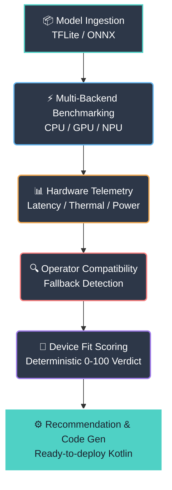

  <h1>📱 EdgeBench AI</h1>
  **An On-Device Diagnostic Profiling & Optimization Workbench for Android AI Models**

  
  

  *Existing tools report numbers. EdgeBench reports a deployment decision.*

  **[Demo Video Link]** | **[GitHub Repository Link](https://github.com/surajsaggam/EdgeBench-AI.git)**

---

## 🚀 The Silent Failure of Mobile AI

Mobile developers deploying AI models—vision, audio, or small language models—face silent, expensive failure modes. A model that benchmarks well for five seconds on a desk can throttle to half its frame rate after thirty seconds in a user's pocket. 

**Current State vs. What Developers Actually Need:**

| ❌ The Problem (Current Tools) | ✅ The Solution (EdgeBench AI) |
| :--- | :--- |
| Point-in-time latency numbers | **Sustained-load, real-device behavior** |
| Desktop-tethered profiling tools | **Standalone on-device diagnostics** |
| Assumed “GPU is always faster” | **Per-model, per-device empirical evidence** |
| Silent CPU fallback on unsupported ops | **Explicit operator-level compatibility report** |
| Manual trial-and-error delegate selection | **A scored, ranked, evidence-backed recommendation** |

> **This is not a benchmarking problem. This is a sustained-performance visibility problem.**

---

## ✨ Key Features: Cutting Through Hardware Fragmentation

EdgeBench is built on principles adapted from established performance-engineering methodologies, applied to the specific reality of on-device AI on flagship Snapdragon Android devices (like iQOO).

### 1. Sustained-Load Truth, Not Marketing Claims
Numbers measured in the first five seconds are marketing claims. EdgeBench incorporates a mandatory warm-up phase and a **sustained steady-state window** to expose thermal throttling, memory pressure, and governor step-downs.

### 2. Multi-Backend Apples-to-Apples Comparison
Snapdragon SoCs expose inference through multiple non-interchangeable paths (CPU XNNPACK, GPU TFLite, NPU Hexagon/NNAPI). EdgeBench runs the identical model through *every available delegate* in one session for true comparative results.

### 3. NPU Operator Compatibility Checker
Not every TFLite/ONNX operator is supported by the NPU. Unsupported ops silently fall back to CPU, creating a slow hybrid execution path. EdgeBench walks the graph and **flags every silent fallback point by name and layer index**.

### 4. Deterministic Device Fit Scoring (DFS)
We don't just dump a trace. We compute a weighted, explainable 0–100 verdict per backend:
- **35%** Latency Efficiency
- **25%** Thermal Stability
- **20%** Compatibility Coverage
- **12%** Jitter Consistency
- **8%** Memory Footprint

### 5. Developer-Ready Kotlin Code Generation
EdgeBench synthesizes the evidence and generates the exact Kotlin delegate-initialization snippet you need to deploy the optimal setup immediately.

---

## 🛠️ The Intelligent Diagnostic Pipeline

1. **Model Ingestion**: Load `.tflite` / `.onnx`, validate schema & metadata.
2. **Multi-Backend Benchmarking**: Warm-up + steady-state loops across CPU / GPU / NPU.
3. **Hardware Telemetry Capture**: Latency percentiles, thermal delta, memory, power draw.
4. **Operator Compatibility Analysis**: Flag Float32 / dynamic ops causing silent CPU fallback.
5. **Deterministic Device Fit Scoring**: Weighted, explainable 0–100 verdict per backend.
6. **Recommendation & Code Gen**: Ranked backend choice + copy-paste Kotlin config.

---

## 📊 Proof of Concept: Validation Case Studies

We validated EdgeBench against real-world TFLite models to prove it catches failure modes that generic profilers miss.

### Case Study A: MobileNetV2 (Fully NPU-Compatible)
* **Finding:** 100% Compatibility Coverage. NPU delivers 3.2ms latency with an excellent Thermal Stability Index.
* **EdgeBench Verdict:** **94/100 (Excellent Fit)** on NPU.
* **Result:** Accurately recommends NNAPI deployment.

### Case Study B: EfficientDet-Lite0 (The Silent NPU Trap)
* **Finding:** Model contains 3 NNAPI-unsupported ops (e.g., Resize-bilinear at layer 14, TopK at layer 41).
* **Impact:** NPU latency (31.9ms) is *slower* than GPU (26.7ms) due to silent CPU fallback overhead mid-graph.
* **EdgeBench Verdict:** NPU scored **52/100**. GPU scored **63/100**.
* **Result:** Recommends GPU delegate, and explicitly flags layers 14 & 41 for INT8 conversion to unlock NPU in the future.

> 💡 *Without EdgeBench, a developer would intuitively assume the NPU is always best and silently ship the slower hybrid execution path to users.*

---

## 📱 Built for iQOO Hackathon 2026

EdgeBench was designed specifically for the operational realities of shipping AI on a flagship Android SoC.

* **Phone-First Execution**: The entire benchmarking + scoring loop runs standalone on-device, no desktop tether required.
* **NPU Integration**: Directly exercises and profiles the Hexagon NPU via NNAPI/QNN.
* **Zero-Cloud Architecture**: Model ingestion, profiling, and recommendation generation happen 100% offline.

> 📸 **Note for Submission:** Please add 2-3 screenshots of the Jetpack Compose UI running live on the iQOO device here to showcase the on-device capabilities.

---

### Team
* **Rishabh Shah** 
* **Anuj Pethe** 
* **Suraj Saggam**
