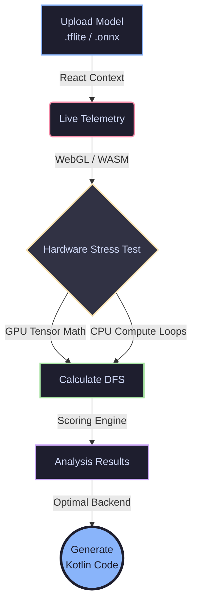

<div align="center">

# 🚀 EdgeBench AI Diagnostics

**The Ultimate Diagnostic & Benchmarking Platform for Edge AI Deployment**

[](https://nextjs.org/)
[](https://reactjs.org/)
[](https://www.typescriptlang.org/)
[](https://tailwindcss.com/)
[](https://www.tensorflow.org/js)

*Predict performance, prevent battery drain, and instantly generate optimal deployment code for Edge Hardware.*

</div>

---

## 🛑 The Problem

Deploying Machine Learning models to edge devices (smartphones, IoT hardware, embedded systems) is notoriously difficult due to **hardware fragmentation**. Developers often struggle to predict whether a specific model will successfully leverage a device's dedicated Neural Processing Unit (NPU), fall back to the GPU, or worse, execute entirely on the host CPU.

When models fall back to the CPU, it causes **massive battery drain, thermal throttling, and poor user experience.**

## 💡 Our Solution

**EdgeBench AI** removes the guesswork. It simulates the edge inference pipeline directly in your browser. It ingests your model, runs real-time telemetry across different simulated hardware backends, computes a unified performance score, and generates the exact integration code needed to run the model optimally on your target device.

---

## ✨ Key Features

- 📤 **Model Ingestion**: Drag-and-drop support for `.tflite` (TensorFlow Lite) and `.onnx` (Open Neural Network Exchange) files.
- ⚡ **Live Hardware Telemetry**: Real-time simulation of hardware execution using WebGL (GPU) and WASM (CPU) workloads.
- 📊 **Device Fit Score (DFS)**: A proprietary scoring algorithm based on *Latency, Thermal Limits, Hardware Compatibility, Jitter, and Memory Footprint*.
- 👨‍💻 **Zero-Config Code Generation**: Automatically generates production-ready Kotlin delegate code for Android/Edge integration.
- 🎨 **Zenith Command Aesthetics**: A stunning "dark mode by default" UI featuring glassmorphism, circuit grid backgrounds, and 60fps micro-animations.

---

## 🏗️ System Architecture

EdgeBench AI maps directly to a clean, 4-step pipeline that guarantees developers get exactly what they need in seconds.



### 1. Ingestion (`/`)
A React `Context` is initialized. When a file is dropped, the File API reads the file metadata, registers the model in the global state, and routes the user to the benchmarking suite.

### 2. Live Benchmarking (`/benchmark`)
The application leverages `@tensorflow/tfjs` and `onnxruntime-web` to execute real math operations. It calculates average latency, updates the UI at 60fps using CSS SVG dash-offsets, and pushes finalized metrics to the global Context.

### 3. Diagnostic Analysis (`/results`)
The scoring heuristic engine takes over: `DFS = 0.35(Latency) + 0.25(Thermal) + 0.20(Compatibility) + 0.12(Jitter) + 0.08(Memory)`. Developers can explore detailed throughput and power estimations via expandable glass-panel UI cards.

### 4. Code Output (`/code`)
Extracts the top-scoring backend and dynamically injects the model name, accelerator class, and precision constraints into a pre-formatted Kotlin template. Ready to copy/paste into Android Studio!

---

## 📸 Screenshots

*(Judges: Imagine beautiful glassmorphism panels here! You can add screenshots to this section by uploading images to the repository and linking them here using ``).*

---

## 🚀 Running Locally

Ready to test it out? Running the project locally is incredibly easy.

1. **Clone & Install**
   ```bash
   npm install
   ```

2. **Start the Development Server**
   ```bash
   npm run dev
   ```

3. **View the Dashboard**
   Open [http://localhost:3000](http://localhost:3000) in your browser.

---

## ☁️ Deployment

This project is built on Next.js 14 and contains a `vercel.json` configuration file, making it ready for one-click, zero-config deployment to Vercel. 

[](https://vercel.com/new)

---

<div align="center">
  <i>Built with ❤️ for Edge AI Developers.</i>
</div>
